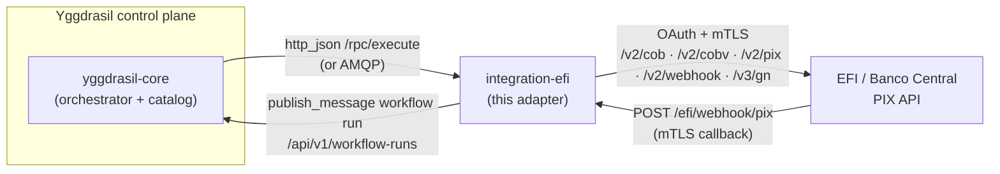
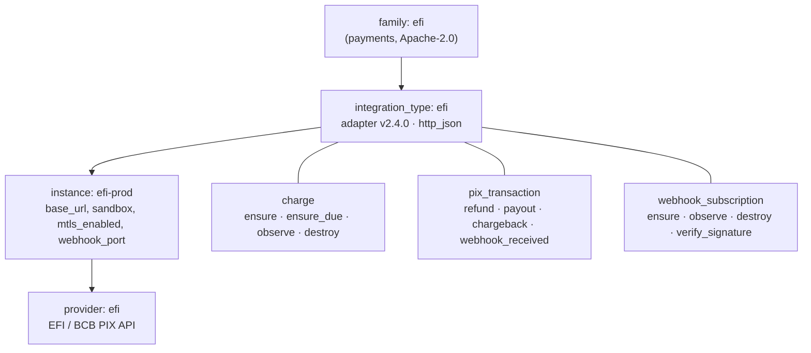
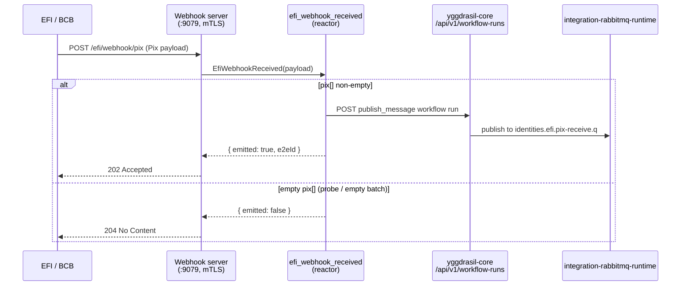

<div align="center">

# integration-efi

**Yggdrasil adapter for Brazilian Pix payments — EFI (Gerencianet) over the Banco Central PIX API.**

[](./LICENSE)
[](./go.mod)
[](https://github.com/dakasa-yggdrasil/integration-efi/pkgs/container/integration-efi)

Charges · payouts · refunds · webhook subscriptions · inbound Pix callbacks ·
[Usage](docs/USAGE.md) · [Configuration](docs/CONFIGURATION.md) · [Capabilities](docs/CAPABILITIES.md) · [Operations](docs/OPERATIONS.md) · [Development](docs/DEVELOPMENT.md)

</div>

---

## What it is

`integration-efi` is a self-contained Yggdrasil **integration adapter** for the
EFI (formerly Gerencianet) Pix payments provider. It speaks the Banco Central
PIX API (`/v2/cob`, `/v2/cobv`, `/v2/pix`, `/v2/webhook`) plus EFI's `/v3/gn`
overlay, authenticating with OAuth client-credentials over **mTLS**. You drive
it declaratively from Yggdrasil workflows — create charges, send payouts, refund
transactions, manage webhook subscriptions — and it turns inbound EFI Pix
callbacks into events on the bus via a webhook reactor.

It is part of **Yggdrasil — the self-hosted control plane for declarative
workflows + integrations over your whole stack.** Think *Backstage, but more
complete and scalable*: an orchestration engine + versioned manifest catalog +
RBAC/policy + OAuth/OIDC + a pluggable integration ecosystem. You write YAML;
Yggdrasil persists, runs, and audits it. This repo is one leaf adapter in that
ecosystem — see [`yggdrasil-core`](https://github.com/dakasa-yggdrasil/yggdrasil-core)
for the engine.

| Fact | Value |
|---|---|
| Provider / type | `efi` / `efi` (single-provider family) |
| Domain | `payments` |
| Adapter version (wire-advertised) | **`2.4.0`** (`providers/efi/adapter/spec.go`) |
| Transport | `http_json` (default) · `amqp` (opt-in) |
| RPC endpoints | `/rpc/describe`, `/rpc/execute` |
| Discovery | `push` (no cursor) — resources are not discoverable |
| Capabilities | **12** — 11 user-dispatched + 1 webhook reactor |
| SDK | `yggdrasil-sdk-go v0.8.3` |
| Image | `ghcr.io/dakasa-yggdrasil/integration-efi` |

> **Version note.** The wire-advertised version is **`2.4.0`** (the
> `AdapterVersion` constant in `providers/efi/adapter/spec.go`, returned by
> `describe`). The `manifest/integration_type.json` file and
> `yggdrasil-quickstart.yaml` still carry older values (`2.2.0` and image tag
> `v1.0.0` respectively) — these are stale catalog metadata; the running binary
> advertises `2.4.0`. See [CONFIGURATION.md](docs/CONFIGURATION.md#version-truth).

## Where it fits



`yggdrasil-core` dispatches capability calls to this adapter over HTTP-JSON (or
AMQP). The adapter talks to EFI/BCB over mTLS. Inbound Pix callbacks land on the
adapter's webhook listener, which emits them back into the control plane as a
`publish_message` workflow run.

## The family → type → instance → provider model



## Capabilities

12 capabilities across 3 resource types. **Idempotent** marks whether repeat
calls reconcile to the same state. Full input/output schema in
[CAPABILITIES.md](docs/CAPABILITIES.md).

| Capability | Resource type | Category | Idempotent | EFI route |
|---|---|---|:--:|---|
| `ensure_charge` | charge | capability | yes | `POST /v2/cob` · `PUT /v2/cob/{txid}` |
| `ensure_due_charge` | charge | capability | yes | `PUT /v2/cobv/{txid}` |
| `observe_charges` | charge | capability | yes | `GET /v2/cob/{txid}` · `GET /v2/cob?inicio=&fim=` |
| `destroy_charge` | charge | capability | yes | `PATCH /v2/cob/{txid}` (status `REMOVIDA_…`) |
| `refund_charge` | pix_transaction | capability | yes | `PUT /v2/pix/{e2eId}/devolucao/{id}` |
| `create_payout` | pix_transaction | capability | no¹ | `PUT /v3/gn/pix/{idEnvio}` |
| `handle_chargeback` | pix_transaction | capability | yes | (pass-through, no HTTP call) |
| `ensure_webhook_subscription` | webhook_subscription | capability | yes | `PUT /v2/webhook/{chave}` (v3 fallback) |
| `observe_webhook_subscriptions` | webhook_subscription | capability | yes | `GET /v2/webhook/{chave}` · `GET /v2/webhook` |
| `destroy_webhook_subscription` | webhook_subscription | capability | yes | `DELETE /v2/webhook/{chave}` |
| `verify_webhook_signature` | webhook_subscription | capability | yes | (pure x509 parse, no HTTP call) |
| `efi_webhook_received` | webhook_subscription | **reactor** | yes | (webhook-fired, not user-dispatched) |

¹ `create_payout` is classified `IntermediateIrreversible` (money movement) — see
[CAPABILITIES.md](docs/CAPABILITIES.md#create_payout).

## Install / Quick start

The adapter ships a `yggdrasil-quickstart.yaml` bundle (family + type + example
instance + deploy ref). Install it through the Yggdrasil CLI:

```bash
yggdrasil install dakasa-yggdrasil/integration-efi
```

This registers the `efi` family + type and seeds the `efi-prod` example
instance. Supply real credentials (see [CONFIGURATION.md](docs/CONFIGURATION.md))
before running a workflow.

**Local dev** (Docker Compose + RabbitMQ):

```bash
task up      # builds the image and brings up rabbitmq + the adapter
task logs    # follow logs
task down    # tear down
```

Health on `:8080`, RPC on `:8081`, webhook listener on `:9079`. See
[DEVELOPMENT.md](docs/DEVELOPMENT.md).

## Configuration

Credentials and instance config are declared on the integration manifest;
runtime knobs come from env vars. Full reference in
[CONFIGURATION.md](docs/CONFIGURATION.md).

| Credential | Secret | Required | Notes |
|---|:--:|:--:|---|
| `efi_client_key_id` | — | yes | EFI Pix API client key ID |
| `efi_client_secret` | yes | yes | EFI Pix API client secret |
| `efi_certificate_base64` | yes | no | Base64 P12 mTLS cert (alt. to mounting a file) |

| Instance field | Type | Default |
|---|---|---|
| `base_url` | string | `https://pix.api.efipay.com.br` |
| `sandbox` | boolean | `false` |
| `mtls_enabled` | boolean | `true` |
| `webhook_port` | integer | `9079` |

## Usage

A minimal workflow that creates an immediate Pix charge through this adapter:

```yaml
apiVersion: yggdrasil.io/v1
kind: Workflow
metadata:
  name: efi-charge-example
  namespace: global
spec:
  steps:
    - name: create-charge
      capability: ensure_charge
      integration_instance_ref:
        namespace: global
        name: efi-prod
      input:
        valor:
          original: "10.00"
        chave: "pix-key@dakasa.me"
        expiracao: 3600
```

`ensure_charge` returns `{ txid, location, pixCopiaECola, status, created_at }`.
The full end-to-end journey (install → configure → first charge → verify the
run) is in [USAGE.md](docs/USAGE.md).

## Webhooks & reactors

EFI delivers Pix callbacks to the adapter's mTLS webhook listener
(`POST /efi/webhook/pix`, port `9079`). The `efi_webhook_received` reactor
normalizes the first `pix[]` entry and emits it into the control plane.



Details and the staging validation runbook are in
[OPERATIONS.md](docs/OPERATIONS.md#webhooks).

## Operations

- **Health** — `GET /healthz` (liveness, always 200), `GET /readyz` (200),
  `GET /metrics` (Prometheus) on port `8080`.
- **Metrics** — `efi_adapter_up`, `efi_webhook_received_total`,
  `efi_request_duration_seconds`, `efi_request_errors_total`,
  `efi_oauth_token_refreshes_total`, `efi_mtls_handshake_failures_total`.
- **Runbook** — [docs/RUNBOOK_STAGING_VALIDATION.md](docs/RUNBOOK_STAGING_VALIDATION.md).

Full detail in [OPERATIONS.md](docs/OPERATIONS.md).

## Development

```bash
go test ./...        # or: task test
task build:image     # docker build -t integration-efi:local .
task up / task down  # local compose stack
```

Repo layout, the describe/execute contract, and `pkg/contractcheck` are
documented in [DEVELOPMENT.md](docs/DEVELOPMENT.md).

## Compatibility

| Component | Version |
|---|---|
| Go | 1.25 |
| `yggdrasil-sdk-go` | v0.8.3 |
| Adapter (this binary) | 2.4.0 |
| Transport | `http_json` (default), `amqp` |

## License

Apache-2.0 — see [LICENSE](./LICENSE).
</content>
</invoke>
