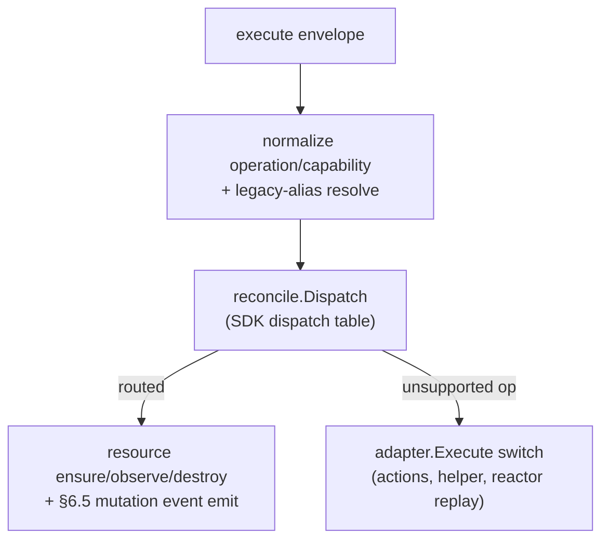

# Development — integration-efi

Build, test, the describe/execute contract, and the repo layout. Commands come
from `Taskfile.yml`, `.github/workflows/`, and the Go source.

← Back to the [README](../README.md) · part of
[Yggdrasil](https://github.com/dakasa-yggdrasil/yggdrasil-core).

---

## Prerequisites

- **Go 1.25** (`go.mod` pins `go 1.25.0`)
- Docker + Docker Compose (for the local stack)
- [`task`](https://taskfile.dev) (Taskfile runner) — optional but recommended

## Build & test

```bash
go test ./...        # full unit suite     (or: task test)
task build:image     # docker build -t integration-efi:local .
```

The image is a multi-stage `distroless/base-debian12:nonroot` build
(`Dockerfile`); the binary is `./cmd/adapter`.

## Local stack

```bash
task env:init   # cp .env.example .env (first run)
task config     # validate the merged compose config
task up         # build + start rabbitmq + adapter (detached)
task logs       # follow logs
task down       # stop + remove
```

Compose merges `docker-compose.yml` (base service) with
`docker-compose.standalone.yml` (adds RabbitMQ + port mappings). Ports exposed:
`8080` (health/metrics), `8081` (RPC), `9079` (webhook).

For mock instances without a real cert, set `EFI_MTLS_ENABLED=false` in `.env`.

## Repo layout

```
cmd/adapter/                  # entrypoint
  main.go                       # SDK adapter wiring, transport select, webhook + health servers, OTel, emit func
  health.go                     # /healthz, /readyz, /metrics server (port 8080)
family/
  manifest.json                 # family `efi` (payments, Apache-2.0)
  contract/types.go             # local copy of the adapter describe/execute wire types
manifest/
  integration_type.json         # type `efi`: adapter, schemas, resource types, discovery
  integration_instance.example.json
  capabilities/*.yaml           # 12 capability manifests (input/output schema)
providers/efi/
  adapter/
    spec.go                     # Describe() contract + AdapterVersion + operation constants + legacy aliases
    adapter.go                  # Execute() switch + register chain
    reconcile.go                # 3 Reconcilers (charge, due_charge, webhook_subscription) — SDK dispatch bridge
    webhook_server.go           # inbound /efi/webhook/pix listener (mTLS)
    mtls.go                     # LoadTLSConfig from P12 (file or base64)
    metrics.go                  # efi_adapter_up, efi_webhook_received_total
    reactor/
      efi_webhook_received.go   # webhook reactor — normalize + emit envelope
    capabilities/*.go           # one handler per capability
  config/config.go              # env loader → Config
  efiapi/
    client.go                   # OAuth + mTLS HTTP client, do/DoRaw, EfiAPIError
    metrics.go                  # efi_request_* , efi_oauth_* , efi_mtls_* + classifyPath
  message/
    describe.go                 # describe handler (version/provider handshake)
    execute.go                  # execute handler — hybrid bridge (reconcile.Dispatch → legacy switch)
    rpc.go                      # success/failure helpers + Handler type
pkg/contractcheck/              # PUBLIC describe-contract lint (importable by other adapters)
deploy/service.yaml             # K8s Service (named ports health/8080, rpc/8081)
yggdrasil-quickstart.yaml       # install bundle (family + type + instance + deploy ref)
docker-compose*.yml, Dockerfile, Taskfile.yml
integration_tests/              # efi_sandbox_test.go, webhook_dedup_test.go
docs/                           # this suite
```

> **Layout note.** This adapter uses `providers/<provider>/...` (not
> `internal/adapter/`). The CLAUDE.md/AGENTS.md in this repo still describe the
> generic `integration-template` (AMQP-only, `internal/adapter/spec.go`) — that
> is stale template context. The code here is the source of truth: HTTP-JSON by
> default, layout under `providers/efi/`.

## The describe / execute contract

Every Yggdrasil adapter exposes two RPC capabilities:

- **`describe`** (`providers/efi/message/describe.go`) — returns
  `adapter.Describe()`: provider, adapter spec (version, transport,
  endpoints/queues), credential + instance schema, resource types, action
  catalog, discovery, normalization, execution spec. yggdrasil-core stores this
  at register time and re-checks it (version + provider) before execute.
- **`execute`** (`providers/efi/message/execute.go`) — routes a capability call.

### The hybrid bridge (v2.2.0+)

`ExecuteHandler` is an **Option B hybrid bridge** (mirroring integration-slack /
integration-stripe v2.x):



1. Inbound envelopes go through `reconcile.Dispatch` **first** — this activates
   §6.5 mutation-event auto-emission for the three resource types (`charge`,
   `due_charge`, `webhook_subscription`).
2. Operations with no registered Reconciler (`refund_charge`, `create_payout`,
   `handle_chargeback`, `verify_webhook_signature`, `efi_webhook_received`) fall
   back to the legacy `adapter.Execute` switch.

`WireReconcilers(a, instanceID)` is called in `main.go` **before** `Register`,
so the SDK auto-installs its dispatch handler; the custom `ExecuteHandler` then
clobbers it (last-write-wins) with the bridge.

### `describe` must stay aligned with `execute`

`pkg/contractcheck` lints that `SupportedExecuteOperations`, `ResourceTypes`, and
`ActionCatalog` stay in sync (the recurring drift that yggdrasil-core's describe
validator rejects at runtime). Keep all three in lockstep when you add or rename
a capability, and update:

- the capability handler under `providers/efi/adapter/capabilities/`
- the `manifest/capabilities/<name>.yaml`
- the operation constant + `SupportedExecuteOperations` + `ActionCatalog` +
  `ResourceTypes.DefaultActions` in `spec.go`
- the unit test for the handler
- the docs ([CAPABILITIES.md](CAPABILITIES.md))

Run the lint via the unit suite: `go test ./...` (the contractcheck test lives in
`pkg/contractcheck/contractcheck_test.go`).

## Transport selection

`YGGDRASIL_TRANSPORT` (default `http`) picks the listener in `main.go`:

- `http` / `http_json` → `a.ListenHTTP(":" + ADAPTER_PORT)` (default `8081`),
  endpoints `/rpc/describe`, `/rpc/execute`.
- `amqp` / `rabbitmq` → `a.ListenAMQP(BROKER_URL)`; **fatal if `BROKER_URL`
  empty**. Queues `yggdrasil.adapter.efi.describe` / `.execute`.

The `describe` response reflects the selected transport (HTTP endpoints vs AMQP
queues).

## CI

`.github/workflows/`:

| Workflow | Trigger | What it does |
|---|---|---|
| `ci.yml` | push to `main`, PRs | `go test ./...` then a Docker build smoke test. |
| `release.yml` | push to `main`, `v*` tags, dispatch | Builds + pushes multi-arch image to `ghcr.io/dakasa-yggdrasil/integration-efi` (tags: `edge` on main, `sha-<short>`, `vX.Y.Z` + `latest` on tags). |
| `emit-deploy-event.yml` | push to `main` | POSTs a deploy event into yggdrasil-core. |

## Versioning

Bump the **`AdapterVersion` constant in `providers/efi/adapter/spec.go`** — that
is the wire-advertised version returned by `describe` and the source of truth.
Keep `manifest/integration_type.json`, `yggdrasil-quickstart.yaml`, the
`CHANGELOG.md`, and a git tag in step (they currently lag — see
[CONFIGURATION.md → Version truth](CONFIGURATION.md#version-truth)).

## Conventions (from this repo's AGENTS.md)

- **Standalone.** Don't import runtime/domain code from yggdrasil-core or the
  monorepo. Wire types stay local (`family/contract/`).
- **Universal capability naming.** Use `ensure_/observe_/destroy_/discover_` for
  resource operations — never `create_/list_/delete_/update_`.
- **Fail fast.** No swallowed errors, no silent degradation.
- **Rename/add a capability → update tests, manifest, and docs in the same
  change.**
</content>
