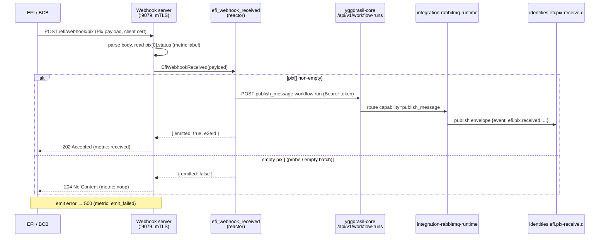

# Operations — integration-efi

Health endpoints, Prometheus metrics, the webhook flow, and common failures —
all grepped from the adapter source (`cmd/adapter/health.go`,
`providers/efi/adapter/metrics.go`, `providers/efi/efiapi/metrics.go`,
`providers/efi/adapter/webhook_server.go`).

← Back to the [README](../README.md) · part of
[Yggdrasil](https://github.com/dakasa-yggdrasil/yggdrasil-core).

---

## Health & readiness

The health server listens on `HEALTHCHECK_PORT` (default **`8080`**),
independent of the RPC transport.

| Endpoint | Method | Behavior |
|---|---|---|
| `/healthz` | GET | Liveness — always `200 ok`. |
| `/readyz` | GET | Returns `200 ready`. (Liveness-style; not gated on broker state in this adapter.) |
| `/metrics` | GET | Prometheus exposition. |

Kubernetes `Service` (`deploy/service.yaml`) maps:

- port `8080` (named `health`) → liveness/readiness probes + Prometheus scrape
- port `8081` (named `rpc`) → `/rpc/describe` + `/rpc/execute` (HTTP-JSON)

> The RPC port `8081` MUST be routed by the Service or yggdrasil-core's
> forward-drift / auto-sync fails with `connection refused` when describing the
> adapter via Service DNS (`integration-efi.dakasa.svc`). This was the 2.3.1
> fix — pre-2.3.1 the live Service only exposed `8080`.

## Metrics

Two metric families: adapter-level (`providers/efi/adapter/metrics.go`) and
HTTP-client-level (`providers/efi/efiapi/metrics.go`).

| Metric | Type | Labels | Meaning |
|---|---|---|---|
| `efi_adapter_up` | gauge | — | `1` when the adapter is healthy (set at boot). |
| `efi_webhook_received_total` | counter | `status`, `pix_status` | Inbound webhook events. `status` ∈ `received` / `noop` / `emit_failed`. |
| `efi_request_duration_seconds` | histogram | `op`, `status_class` | Duration of outbound EFI API calls. |
| `efi_request_errors_total` | counter | `op`, `status` | Non-2xx EFI responses. |
| `efi_oauth_token_refreshes_total` | counter | `result` | OAuth token refreshes (`success` / `decode_fail` / `empty_token`). |
| `efi_mtls_handshake_failures_total` | counter | — | Outbound mTLS handshake failures. |

`op` label values (`classifyPath`): `oauth`, `cob`, `create_due_charge`,
`get_statement`, `refund_charge`, `create_payout`, `webhook`, `other`.
`status_class` ∈ `2xx` / `4xx` / `5xx` / `transport`.

Each outbound EFI call also opens **one OpenTelemetry span** (`efi.<op>`) when
`OTEL_EXPORTER_OTLP_ENDPOINT` is set.

### Useful queries

```promql
# Adapter healthy?
efi_adapter_up

# Outbound error rate by operation
rate(efi_request_errors_total[5m])

# p99 latency for immediate charges
histogram_quantile(0.99, rate(efi_request_duration_seconds_bucket{op="cob"}[5m]))

# Webhook deliveries by outcome
sum by (status) (rate(efi_webhook_received_total[5m]))
```

---

## Webhooks

EFI delivers Pix callbacks to the adapter's **inbound webhook listener** on
`webhook_port` (default **`9079`**), separate from the RPC and health ports.

### Routes (`providers/efi/adapter/webhook_server.go`)

| Route | Method | Response |
|---|---|---|
| `/efi/webhook/pix` | GET | `200` — URL-validation probe (`EFI Pix Webhook is operational`). |
| `/efi/webhook/pix` | POST | `202` first delivery · `204` empty `pix[]` · `500` on emit failure · `400` bad JSON. |

**mTLS is required** when an mTLS cert is loaded: the listener sets
`ClientAuth = RequireAndVerifyClientCert`, so EFI must present a client cert.
Pass `nil` TLS config (mock mode, `mtls_enabled=false`) to run HTTP-only.

### Flow



The adapter does **not** dedup. Duplicate deliveries are tolerated downstream by
a `webhook_event_efi.e2e_id UNIQUE` constraint in the identities consumer.

> The webhook port `9079` is intentionally **not** in the Kubernetes Service —
> that ingress is routed separately behind the external webhook receiver / mTLS
> terminator (see the comment block in `deploy/service.yaml`).

### Emission requires core wiring

The reactor POSTs to `${YGGDRASIL_CORE_BASE_URL}/api/v1/workflow-runs` with a
`Bearer ${YGGDRASIL_WORKFLOW_RUN_TOKEN}`. If `YGGDRASIL_CORE_BASE_URL` is unset,
the reactor logs a WARN and **skips** emission (dev mode) — the webhook still
returns success, but nothing reaches the bus.

---

## Common failures

| Symptom | Likely cause | Fix |
|---|---|---|
| Worker exits at boot with `EFI_MTLS_ENABLED=true but no EFI_CERTIFICATE or EFI_CERTIFICATE_BASE64 set` | mTLS on, no cert source | Mount a P12 at `EFI_CERTIFICATE` or set `efi_certificate_base64`. |
| `oauth_failed` error / `efi_oauth_token_refreshes_total{result="decode_fail"}` | Bad `efi_client_key_id`/`efi_client_secret` | Verify credentials; secret rotated? |
| `efi_mtls_handshake_failures_total` climbing | Expired/wrong client cert | Rotate the P12; restart the pod. |
| `efi_request_errors_total{status="429"}` | EFI rate limit | Back off; transient (`IsTransient()` retries 429/503/504). |
| `connection refused` describing via Service DNS | Service missing rpc port `8081` | Apply `deploy/service.yaml` (the 2.3.1 fix). |
| Webhook returns `502/connection refused` | Listener not reachable on `9079` | Check the external webhook ingress + mTLS terminator routing. |
| `efi_webhook_received_total{status="emit_failed"}` | Reactor emit to core failing | Check `YGGDRASIL_CORE_BASE_URL` + `YGGDRASIL_WORKFLOW_RUN_TOKEN`; check core `/api/v1/workflow-runs`. |
| Webhook returns `204` for every call | Empty `pix[]` (probe or empty batch) | Expected — only non-empty `pix[]` emits. |

### Transient vs terminal (outbound)

`efiapi.IsTransient()` marks **429, 503, 504** as retryable; **500** is
deliberately non-transient; all other 4xx are terminal (caller bug). The SDK
handles retry of transient errors; transport-level errors are the SDK's
responsibility.

---

## Staging validation runbook

Before a production cutover, run the staged validation procedure (100 charges +
100 webhook callbacks + duplicate-delivery dedup check) in:

→ **[RUNBOOK_STAGING_VALIDATION.md](RUNBOOK_STAGING_VALIDATION.md)**

The acceptance gate: all three tests pass and zero alerts fire in a 30-minute
observation window.

## Graceful shutdown

On `SIGINT`/`SIGTERM` the adapter (`cmd/adapter/main.go`) cancels the run
context, stops the webhook server (5s deadline) and the health server (10s
deadline), and drains the SDK adapter. mTLS, OTel, and the RPC listener all shut
down cleanly.
</content>
